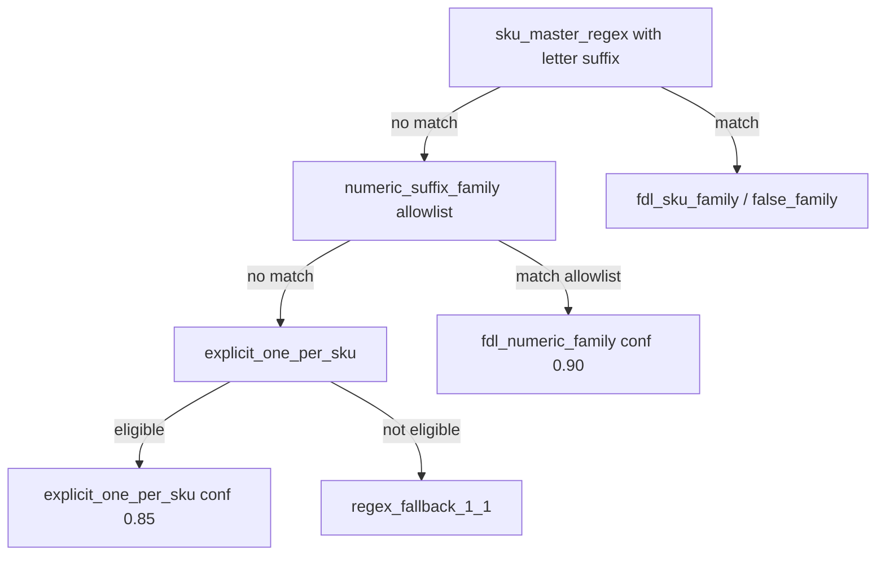

> **Status: ARCHIVED** — Ordia v0.6 Workstream E (E-03c), 2026-06-14.
> Import design history; see active import track in `docs/coordination/IMPORT_PARSER_BACKLOG.md`.

# PR-K: Family regex design for numeric-suffix SKUs

Status: **Phase K0 implemented and validated** — see `temp/pr_k_k0_validation_report.json`. **Phase K1A implemented (MU/MP/MPS)**; **Phase K1B deferred (MH/MHA)** until suffix-letter sub-family policy is approved.

## Problem

PR-J `explicit_one_per_sku` applies when the FDL family regex misses (no trailing letter suffix). Many weight-variant products in `DISCOS Y BARRAS` use SKUs like `DOP010`, `MH002`, `MU005` — distinct masters per weight today, but they should share a family master with `peso_kg` extracted from the numeric segment.

Family regex today:

```regex
^(?P<prefix>[A-Z]+?)(?P<size>\d{2,3})(?P<suffix>[A-Z]+)$
```

Requires a **letter suffix** after digits (`DOBNEXO05N` matches; `DOP010` does not).

## Design principles

1. **Do not weaken PR-J guardrails** — `explicit_one_per_sku` remains for true 1:1 equipment (CARDIO BIC/REM/CIN, accessories).
2. **Extend family regex or add tiered patterns** — numeric-only suffix SKUs with known safe prefixes.
3. **Run after taxonomy, before explicit_one_per_sku fallback** — same pipeline order as PR-J.
4. **Exclude false-family and repuesto paths** — reuse existing `_is_spurious_family_split`, denied prefixes, REPUESTO exclusion.
5. **Confidence** — family match ≥ 0.85; false-family remains ≤ 0.4.

## Proposed prefix families (priority order)

| Priority | Prefix | Example SKUs | Master key | Variant axis | Category | Risk |
|----------|--------|--------------|------------|--------------|----------|------|
| P0 | DOP | DOP005–DOP025 | DOP | peso_kg from size | discos | high |
| P0 | DOPH | DOPH001–DOPH025 | DOPH | peso_kg | discos | high |
| P0 | DNG | DNG001–DNG025 | DNG | peso_kg | discos | high |
| P0 | DOB | DOB005–DOB025 | DOB | peso_kg | discos | high |
| P0 | DOBN | DOBN005–DOBN025 | DOBN | peso_kg | discos | medium |
| P1 | MH | MH002–MH050 | MH | peso_kg | mancuernas* | high |
| P1 | MU | MU002–MU050 | MU | peso_kg | mancuernas/kettlebells* | high |
| P1 | MP | MP002–MP050 | MP | peso_kg | discos* | high |
| P1 | MPS | MPS002–MPS050 | MPS | peso_kg | discos* | high |
| P2 | BN | BN085–BN220 | BN | length_cm from size | barras | medium |
| P2 | BO | BO085–BO220 | BO | length_cm | barras | medium |
| P2 | BOR | BOR120–BOR220 | BOR | length_cm | barras | medium |
| P2 | MBPR | MBPR010–MBPR045 | MBPR | peso_kg | discos | medium |
| P2 | MBPZ | MBPZ010–MBPZ045 | MBPZ | peso_kg | discos | medium |

\*Taxonomy fix may be required separately — PR-J audit found MH/MU/MP/MPS mapped to `discos` via `DISCOS Y BARRAS|disco` keyword rule.

## Proposed regex extension

Option A — **optional suffix letter** on existing pattern:

```regex
^(?P<prefix>[A-Z]+?)(?P<size>\d{2,3})(?P<suffix>[A-Z]+)?$
```

With **allowlist** of prefixes that may use empty suffix (deny-by-default for unknown prefixes).

Option B — **second pattern** in config `numeric_suffix_family_regex`:

```regex
^(?P<prefix>DOP|DOPH|DNG|DOB|DOBN|MH|MU|MP|MPS|BN|BO|BOR|MBPR|MBPZ)(?P<size>\d{2,3})$
```

Option B is safer for PR-K (no broad accidental family creation).

## Pipeline placement



## Rows that must stay 1:1 (do not family-group in PR-K)

- CARDIO: BIC*, REM*, CIN*, ELI*, SKI*, TRI*, REB*
- Accessories: SOP*, VAR*, PK*, BBP*, BTN*
- REPUESTO-* (separate policy)
- Configurator SKUs with `-` (FDRig-3)
- All false-family NEXO patterns

## Acceptance criteria for PR-K (Phase K0 — implemented)

1. `DOP010` + `DOP015` share master `DOP` with variant `peso_kg` from **name** (not SKU digits).
2. `DOP4A010` shares master `DOP4A` (separate from `DOP`).
3. CARDIO `BIC010` remains `explicit_one_per_sku`.
4. `CRO107NEXO` / `BOC001NEXO` unchanged (false_family).
5. K0 family rows confirmable at ≥ 0.85 grouping confidence.
6. Run `audit_pr_k_k0_validation.py` — status `pass`.

## Phase K1 — Variant axis exclusion policy

**Prerequisite:** K0 validation pass (`docker compose exec -e PYTHONPATH=/app api python scripts/audit_pr_k_k0_validation.py`). K1 preflight audit (`docker compose exec -e PYTHONPATH=/app api python scripts/audit_pr_k1_preflight.py`) must pass policy review before any grouping code change.

**K1 safe variant axis:** `peso_kg` extracted from **product name only** — never from SKU numeric digits alone, never from suffix letters.

Suffix letters and SKU suffixes are **exclusion candidates**, not automatic variant attributes.

### Exclusion candidates (never auto-variant axes in K1)

| Concept | Examples in FDL | PIM layer today | K1 rule |
|---------|-----------------|-----------------|---------|
| **acabado** | Cromada, mate | `acabado` spec; catalog highlight | Do not split family by finish; master/common spec only if name confirms |
| **proveedor/línea** | NEXO brand; DOP vs DOPH prefix | `brand_id`, `master_key` prefix | Prefix difference = **different family**, not variant |
| **tipo de producto** | Disco vs mancuerna vs barra | `category_id` / taxonomy | Category mismatch blocks grouping |
| **variante comercial** | "4 Agarres", "Premium Hexagonal" | `master_name` cleanup | Separate product line → separate master (e.g. DOP vs DOP4A) |
| **codificación interna** | `MH002A`, `BN120Z`, `BOR220A` | SKU suffix letter | **Not** a variant axis until audit confirms meaning |

### Suffix-letter behavior (required for K1 implementation)

1. **Unclear meaning** → stay `needs_review` or `explicit_one_per_sku` (do not family-group).
2. **Different product family** (e.g. `MH` vs `MHA`, `BN` vs `BNZ`) → **prevent grouping** across suffix sub-families.
3. **Irrelevant internal coding** → may ignore suffix **only after** PDF audit evidence (document in report, not code).
4. **Confirmed meaning later** → separate PR for `spec_definitions` or grouping logic.

### K1 allowlist scope

- **K1A (implemented):** `MU`, `MP`, `MPS` with `mapped_category_slug == mancuernas` gate
- **K1B (deferred):** `MH`, `MHA` — suffix-letter sub-family decision required first
- Variant axis: **`peso_kg` from name** only
- **Not in K1:** `BN`, `BO`, `BOR` (length axis, Phase K2); `MBPR`, `MBPZ` (manual review)

PDF evidence for suffix ambiguity:

- `MH002A`, `MH007A` — must not auto-merge with `MH002`/`MH007` without explicit sub-family design
- `BN120Z`, `BOR220A` — curl/alternate sub-lines; defer to K2

### Acceptance criteria for K1 (suffix-safe)

1. `MH005` and `MH010` may share master `MH` with `peso_kg` 5 and 10 **only if** suffix-letter sub-family rules are approved for that prefix.
2. `MH002` and `MH002A` must **not** share a master until suffix meaning is confirmed (`family_mh_suffix_ambiguous_negative.json`).
3. `MH010` and `MP010` must **not** share a master (`family_mh_vs_mp_negative.json`).
4. No suffix letter written to `parsed_variant_specs_raw`.
5. All K1 rows map to `mancuernas` (taxonomy regression check).
6. Run `audit_pr_k1_preflight.py` before merging K1 grouping code.

### Out of scope for K1 initial slice

- New `spec_definitions` for proveedor/línea, tipo_producto, variante_comercial
- Encoding exclusion candidates in `import_grouping.py` until audit pass
- Assuming suffix letters are variant axes by default

## Acceptance criteria for PR-K (legacy — superseded by Phase K0/K1 split above)

1. ~~`MH002`–`MH010` share master `MH`~~ — deferred to K1 with suffix-safe rules.

## Out of scope for PR-K

- MATERIAL DE ESTUDIO mapping
- CROSSTRAINING full PDF path (PR-I0 workflow / separate taxonomy PR)
- Repuesto 1:1 policy (PR-L)
- Bundle/configurator grouping (PR-M)
