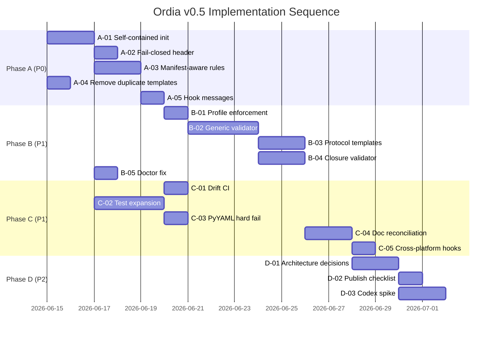

> **Status: ARCHIVED** — Ordia v0.8 phase-2 cleanup, 2026-06-14.
> Active specs: `docs/ordia/SPEC_v0.6.md` and later. Do not edit except to fix links.

# Ordia Improvement Plan v0.5

**Status:** DONE — v0.5 exit gates PASS (2026-06-14)  
**Baseline:** [SPEC_v0.4.md](./SPEC_v0.4.md) (extraction baseline — reference-ready)  
**Target:** v0.5 — greenfield self-contained + portable core hardening  
**Shipped spec:** [SPEC_v0.5.md](./SPEC_v0.5.md) · [PUBLISH_CHECKLIST.md](./PUBLISH_CHECKLIST.md) · [CODEX_ENFORCEMENT_SPIKE.md](./CODEX_ENFORCEMENT_SPIKE.md)  
**QA evidence:** `temp/qa/ordia-v05/ORDIA_V05_QA_REPORT.md`

---

## 1. Executive summary

Ordia v0.4 delivers a **working control plane for Narofitness** (manifest, hooks,
rules, validator, CLI, packages). The audit confirmed **29/29 tests PASS** and
full reference validation.

v0.4 is **not yet a portable product GA**. Greenfield projects with
`ordia init --with-cursor` are not self-contained; rules and validators remain
coupled to `docs/coordination/`; lifecycle protocols are not extracted to core.

This plan converts audit findings into **four phased workstreams** with explicit
acceptance criteria, validation gates, and decision checkpoints. Estimated
effort: **3–5 implementation slices** (excluding marketplace publish).

| Phase | Goal | Exit gate |
|---|---|---|
| **A — Hardening (P0)** | Fix security/portability blockers | Greenfield `--with-cursor` E2E PASS |
| **B — Core extraction (P1)** | Manifest-driven rules + generic validator | `ordia validate --project` works on greenfield |
| **C — Quality & drift (P1)** | Tests, doc sync, single template source | Drift CI + 40+ tests PASS |
| **D — Product readiness (P2)** | Publish prep, open questions resolved | ORDIA-D007+ recorded; publish checklist complete |

---

## 2. Current state (audit baseline)

### 2.1 Strengths (preserve)

| Area | Evidence |
|---|---|
| Session API | Runtime × Protocol × UNIFIED implemented in hooks |
| Manifest | `ordia.yaml` v0.2 loaded from `packages/ordia-core` |
| Reference integration | `control:validate`, `ordia:validate`, `ordia:doctor` PASS |
| Profile separation | `ordia-*.mdc` portable + `narofitness-permanent-guardrails.mdc` |
| Package layout | `packages/ordia-core`, `packages/ordia-cursor` stubs exist |
| Monorepo init | `ordia init --template monorepo` scaffolds clean tree |

### 2.2 Gaps (address in this plan)

| ID | Severity | Gap |
|---|---|---|
| G-01 | **P0** | `init --with-cursor` installs hooks but not config runtime → hooks fail without `ordia-core` |
| G-02 | **P0** | `validate_runtime_header.py` fail-open on exception |
| G-03 | **P0** | Rules hardcode `docs/coordination/` — greenfield uses `docs/control/` |
| G-04 | **P0** | Duplicate template source: `docs/ordia/templates/minimal/` vs package templates |
| G-05 | **P1** | `Ordia profile:` header parsed but never validated against manifest |
| G-06 | **P1** | `validate_project_control.py` hardcodes `docs/coordination/` |
| G-07 | **P1** | Fallback paths in hooks (`STATE_RELATIVE`, `CONTROL_DOC_MARKERS`) ignore `docs/control/` |
| G-08 | **P1** | Lifecycle protocols not in `@ordia/core` — only in Narofitness coordination docs |
| G-09 | **P1** | Closure gate (RUNTIME-D006) not enforced by validator |
| G-10 | **P1** | No automated drift check: live `.cursor/` vs `packages/ordia-cursor/templates/` |
| G-11 | **P2** | SPECs v0.1–v0.3 stale (paths, status, loader references) |
| G-12 | **P2** | `hooks.json` uses `py -3` — Windows-only default |
| G-13 | **P2** | PyYAML missing → silent config degradation |
| G-14 | **P2** | Open questions SPEC v0.1 §10 unresolved |
| G-15 | **P2** | No PyPI / Cursor marketplace publish path |

---

## 3. Target state (v0.5)

```text
Greenfield repo (ordia init --with-cursor)
├── ordia.yaml                    # profile + control.root: docs/control
├── docs/control/                 # minimal registry/state
├── .cursor/
│   ├── hooks/                    # self-contained config loader
│   └── rules/ordia-*.mdc         # manifest-aware recovery paths
└── vendor/ordia-core/            # OR pip-installed ordia-core

Commands:
  ordia validate          → PASS (manifest + paths)
  ordia validate --project → PASS (generic registry validator)
  ordia doctor            → PASS (checks target dir, not CLI source repo)
```

**Non-goals for v0.5:** marketplace listing, full Codex-only enforcement parity,
renaming Narofitness `docs/coordination/`.

---

## 4. Workstreams

### Workstream A — Security & greenfield blockers (P0)

#### A-01 — Self-contained cursor init

| Field | Value |
|---|---|
| **Gap** | G-01 |
| **Problem** | Hooks call `ordia.config.load_ordia_config` but greenfield has no package on path |
| **Solution** | On `init --with-cursor`, vendore one of: (a) `vendor/ordia-core/` minimal copy, (b) `scripts/` shims + bootstrap, or (c) inline `hooks/lib/ordia_manifest.py` (YAML-only, no PyYAML dep). **Recommended:** (c) for zero-deps hooks + optional full core via pip |
| **Files** | `packages/ordia-core/ordia/cli.py`, new `packages/ordia-cursor/templates/hooks/lib/ordia_manifest.py`, `control_context.py` (both live + template) |
| **Acceptance** | Temp dir: `ordia init --with-cursor` → hook `get_ordia_config()` returns config with `docs/control` paths without pip install |
| **Validation** | New E2E test in `scripts/test_ordia_greenfield.py` |

#### A-02 — Header hook fail-closed

| Field | Value |
|---|---|
| **Gap** | G-02 |
| **Problem** | Exception in `validate_runtime_header.py` allows change-capable prompts |
| **Solution** | On exception: `permission: deny` with user_message; log agent_message with error; return non-zero |
| **Files** | `.cursor/hooks/validate_runtime_header.py`, template copy, `scripts/test_control_hooks.py` |
| **Acceptance** | Mocked exception → deny; normal flow unchanged |
| **Validation** | Unit test `test_header_hook_fail_closed_on_exception` |

#### A-03 — Manifest-aware recovery rules

| Field | Value |
|---|---|
| **Gap** | G-03, G-07 |
| **Problem** | `ordia-recovery-bootstrap.mdc` lists fixed `docs/coordination/*` paths |
| **Solution** | Rewrite mandatory read order to: (1) `ordia.yaml` → resolve `control.root`, (2) read `{control.root}/ORCHESTRATION_STATE.md` §0, (3) protocol docs from `@ordia/core/protocols/` or profile override. Add template variables in greenfield `AGENTS.md` |
| **Files** | `.cursor/rules/ordia-recovery-bootstrap.mdc`, template rules, optional `ordia-runtime-protocol-header.mdc` § parsing rule #2 |
| **Acceptance** | Greenfield with `docs/control/` — agent recovery instructions reference correct paths |
| **Validation** | Rule text review + greenfield E2E sessionStart context contains `docs/control` |

#### A-04 — Remove duplicate template source

| Field | Value |
|---|---|
| **Gap** | G-04 |
| **Problem** | `docs/ordia/templates/minimal/` duplicates `packages/ordia-core/ordia/templates/minimal/` |
| **Solution** | Delete `docs/ordia/templates/`; update SPEC v0.3 §3 and README to point to package path only |
| **Files** | Delete `docs/ordia/templates/**`; update `docs/ordia/SPEC_v0.3.md`, `docs/ordia/README.md` |
| **Acceptance** | Single canonical template tree; no references to deleted path |
| **Validation** | `rg "docs/ordia/templates"` returns zero hits |

#### A-05 — Fix hardcoded hook messages

| Field | Value |
|---|---|
| **Gap** | G-07 |
| **Problem** | `guard_mode_before_edit.py` agent_message says `docs/coordination/` |
| **Solution** | Resolve control root from config; interpolate in deny messages |
| **Files** | `guard_mode_before_edit.py` (live + template), `control_context.py` helper `control_root_hint(root)` |
| **Acceptance** | Deny message on greenfield references `docs/control/` |

**Phase A exit gate:**

```powershell
npm run control:test
npm run ordia:validate
python scripts/test_ordia_greenfield.py   # new
# Manual: ordia init --with-cursor in temp dir → sessionStart + edit guard work
```

---

### Workstream B — Core extraction & validation (P1)

#### B-01 — Profile header enforcement

| Field | Value |
|---|---|
| **Gap** | G-05 |
| **Problem** | SPEC v0.2 requires `Ordia profile:` match manifest `profile` — not enforced |
| **Solution** | In `beforeSubmitPrompt`: if header declares profile and ≠ manifest.profile → warn in sessionStart context; optional `--strict-profile` in validator → error |
| **Files** | `control_context.py`, `validate_runtime_header.py`, `ordia/config.py` (`validate_ordia_manifest`) |
| **Acceptance** | Mismatch `Ordia profile: foo` vs `profile: bar` → warning logged; strict mode → validate FAIL |

#### B-02 — Manifest-driven project validator

| Field | Value |
|---|---|
| **Gap** | G-06 |
| **Problem** | `validate_project_control.py` uses hardcoded `COORDINATION = docs/coordination` |
| **Solution** | Split into: (1) `ordia validate` — manifest-only (exists); (2) new `ordia/validator/project.py` — reads paths from `OrdiaConfig`, validates registry/state/tasks generic schema; (3) Narofitness-specific checks (inventory, UX tracks) stay in `validate_project_control.py` as `--profile narofitness` extension |
| **Files** | New `packages/ordia-core/ordia/validator/`, refactor `scripts/validate_project_control.py` |
| **Acceptance** | `ordia validate --project` PASS on greenfield scaffold; Narofitness still PASS via extended checks |
| **Validation** | Greenfield temp dir test + existing 12 validator tests |

#### B-03 — Extract portable protocol templates

| Field | Value |
|---|---|
| **Gap** | G-08 |
| **Problem** | `TASK_EXECUTION_PROTOCOL.md`, runtime protocols live only in Narofitness |
| **Solution** | Add `packages/ordia-core/ordia/protocols/` with neutral templates (`TASK_EXECUTION.md`, `CURSOR_ORCHESTRATION.md`, `CURSOR_IMPLEMENTATION.md`, `RECOVERY_RUNBOOK.md`). Narofitness keeps `docs/coordination/*` as **profile overlays** that include/extend core templates. `ordia init` copies core protocols into `docs/control/protocols/` |
| **Files** | New protocol templates; update rules routing matrix to prefer `{control.root}/protocols/` |
| **Acceptance** | Greenfield init includes protocol stubs; rules route correctly |
| **Decision** | Requires **ORDIA-D007** — protocol path convention |

#### B-04 — Closure gate validator hook

| Field | Value |
|---|---|
| **Gap** | G-09 |
| **Problem** | RUNTIME-D006 closure checklist is agent-honor only |
| **Solution** | Add `ordia/validator/closure.py` — when task status → `VALIDATED` in registry, verify: evidence index entry, packet updated, state summary, `control:validate` PASS recorded. Wire as warning (v0.5) → error (v0.6) |
| **Files** | New validator module; `validate_project_control.py` or `ordia validate --strict-closure` |
| **Acceptance** | Transition to VALIDATED without evidence update → validator warning/error |

#### B-05 — Doctor targets consumer directory

| Field | Value |
|---|---|
| **Gap** | G-01 (partial) |
| **Problem** | `cmd_doctor` reports ordia-core from CLI source repo, not `--directory` |
| **Solution** | Check `target/packages/ordia-core`, `target/vendor/ordia-core`, pip import, and inline manifest loader |
| **Files** | `packages/ordia-core/ordia/cli.py` |
| **Acceptance** | `ordia doctor -C /tmp/greenfield` reports correct runtime presence |

**Phase B exit gate:**

```powershell
ordia init --with-cursor -C %TEMP%\ordia-v05-test --profile demo
cd %TEMP%\ordia-v05-test && ordia validate --project
npm run control:validate   # Narofitness reference unchanged PASS
```

---

### Workstream C — Quality, drift & documentation (P1)

#### C-01 — Drift detection CI

| Field | Value |
|---|---|
| **Gap** | G-10 |
| **Problem** | Live hooks/rules can diverge from `packages/ordia-cursor/templates/` |
| **Solution** | Add `scripts/sync_ordia_cursor_bundle.py` (copy live → template OR verify hash); add `scripts/test_ordia_bundle_drift.py`; wire into `npm run control:test` |
| **Acceptance** | Drift test FAIL if live ≠ template; PASS after sync |

#### C-02 — Expand test matrix

| Field | Value |
|---|---|
| **Gap** | Audit §6 |
| **Problem** | No E2E greenfield, no `--with-cursor`, no profile mismatch tests |
| **Solution** | New `scripts/test_ordia_greenfield.py` covering: init minimal, init monorepo, init --with-cursor, validate, doctor, hook config load, profile mismatch |
| **Target** | ≥ 40 total control/ordia tests |

#### C-03 — PyYAML hard fail

| Field | Value |
|---|---|
| **Gap** | G-13 |
| **Problem** | Missing PyYAML returns empty config silently |
| **Solution** | If manifest exists and yaml unavailable → return None + doctor/validate error with install hint |
| **Files** | `ordia/config.py`, tests |

#### C-04 — Documentation reconciliation

| Field | Value |
|---|---|
| **Gap** | G-11 |
| **Problem** | SPEC v0.1 status DRAFT; v0.2–v0.3 stale paths |
| **Solution** | Publish [SPEC_v0.5.md](./SPEC_v0.5.md) summarizing v0.5 scope; update v0.1 status ACTIVE; fix v0.2 §4 loader refs; fix v0.3 §3 template path; add IMPROVEMENT_PLAN link to README |
| **Acceptance** | `rg "docs/ordia/templates"` and stale loader refs = 0 |

#### C-05 — Cross-platform hooks.json

| Field | Value |
|---|---|
| **Gap** | G-12 |
| **Problem** | `py -3` is Windows-centric |
| **Solution** | Document in bundle README; provide `hooks.json` variants or use `python3` with install note; `ordia init --with-cursor` selects by platform or writes generic `python` with doctor check |
| **Decision** | **ORDIA-D008** — hook command convention |

**Phase C exit gate:**

```powershell
npm run control:test        # ≥ 40 tests
npm run control:validate
npm run ordia:doctor
```

---

### Workstream D — Product readiness (P2)

#### D-01 — Resolve open architecture questions

| Field | Value |
|---|---|
| **Gap** | G-14 |
| **Status** | **DONE** — `ORDIA-D007`–`ORDIA-D013` recorded 2026-06-14 |
| **Output** | See `docs/coordination/DECISION_LOG.md` |

#### D-02 — Publish checklist

| Field | Value |
|---|---|
| **Gap** | G-15 |
| **Deliverable** | `docs/ordia/PUBLISH_CHECKLIST.md` — PyPI (`ordia-core`), npm wrapper, Cursor marketplace, versioning, changelog |
| **Acceptance** | Checklist complete; no publish until v0.5 exit gates PASS |

#### D-03 — Codex-only enforcement path (spike)

| Field | Value |
|---|---|
| **Gap** | SPEC v0.1 §10 |
| **Problem** | No hooks under Codex — validator-only? |
| **Solution** | Spike: document minimum viable enforcement (prompt prefix + `ordia validate` in CI); optional Codex skill/rule pack |
| **Acceptance** | Spike doc in `docs/ordia/CODEX_ENFORCEMENT_SPIKE.md` |

---

## 5. Implementation sequence



**Recommended slice order for executors:**

1. **Slice 1 (P0 core):** A-01, A-02, A-04, A-05, B-05, C-03  
2. **Slice 2 (P0 rules + tests):** A-03, C-01, C-02 (greenfield E2E)  
3. **Slice 3 (P1 validator):** B-01, B-02, B-04  
4. **Slice 4 (P1 protocols + docs):** B-03, C-04, C-05  
5. **Slice 5 (P2 product):** D-02, D-03 → SPEC v0.5 + publish checklist *(D-01 closed)*

---

## 6. Decision checkpoints

**Status:** **CLOSED** — recorded as `ORDIA-D007`–`ORDIA-D013` in `docs/coordination/DECISION_LOG.md` (2026-06-14).

| ID | Question | Decision | Blocker for |
|---|---|---|---|
| **ORDIA-D007** | Protocol path convention | `{control.root}/protocols/` (Narofitness flat `*_PROTOCOL.md` = profile exception) | B-03 |
| **ORDIA-D008** | Hook command in `hooks.json` | `{PYTHON}` = `sys.executable` at init; doctor verifies | C-05 |
| **ORDIA-D009** | Greenfield config runtime | Inline stdlib loader (required) + full `ordia-core` (optional) | A-01 |
| **ORDIA-D010** | Repo layout for Ordia product | Monorepo until v0.5 + publish checklist; split deferred | D-02 |
| **ORDIA-D011** | Decision ID prefix | `ORDIA-D###` product + profile-scoped project prefixes | — |
| **ORDIA-D012** | Codex-only enforcement | Prompt contract + validator/CI; no hook parity required | D-03 |
| **ORDIA-D013** | Extension vs CLI-only | CLI-first; marketplace post-v0.5 | D-02 |

Implementation may proceed with **Slice 1** once this section is closed.

---

## 7. Risk register

| Risk | Likelihood | Impact | Mitigation |
|---|---|---|---|
| Breaking Narofitness hooks during refactor | Medium | High | Keep reference tests; Phase A exit gate before B |
| Rule changes confuse existing Cursor sessions | Medium | Medium | Version rules; document in SPEC v0.5 changelog |
| Generic validator too weak vs Narofitness validator | Medium | Medium | Layer profile extensions; never remove Narofitness checks |
| Inline YAML loader diverges from ordia-core | Low | Medium | Share test fixtures; single schema definition |
| Scope creep into UX30/IMPORT-FDL | High | Medium | Ordia tasks forbid product code; profile docs only |

---

## 8. Metrics & definition of done (v0.5)

| Metric | v0.4 baseline | v0.5 target | v0.5 actual |
|---|---|---|---|
| Control/Ordia tests | 29 | ≥ 40 | **51** |
| Greenfield `--with-cursor` E2E | FAIL (no runtime) | PASS | **PASS** |
| `ordia validate --project` on greenfield | FAIL | PASS | **PASS** |
| Duplicate template paths | 2 | 1 | **1** *(corrected to **0** in v0.6 Slice 1 — `ORDIA-D021`)* |
| Drift test (live vs bundle) | None | PASS in CI | **PASS** |
| Fail-open header hook | Yes | No | **No** |
| Profile header validation | No | Yes (warn min; strict optional) | **Yes** |
| SPECs stale references | ≥ 4 | 0 | **0** *(AGENTS.md drift fixed in v0.6 Slice 1)* |

**v0.5 DONE when:**

- [x] All Phase A–C exit gates PASS  
- [x] SPEC_v0.5.md published  
- [x] ORDIA-D007–D013 recorded *(done 2026-06-14)*
- [x] `npm run control:validate` PASS (Narofitness reference)  
- [x] Greenfield E2E documented in `EVIDENCE_INDEX` or Ordia QA report  
- [x] PUBLISH_CHECKLIST.md complete (publish execution deferred)  
- [x] CODEX_ENFORCEMENT_SPIKE.md complete  

---

## 9. Scope boundaries

**In scope:** Ordia packages, hooks, rules, CLI, validator, Ordia docs, Narofitness control-doc wiring.

**Out of scope:** `apps/**` product code, IMPORT-FDL, UX30 UI, marketplace publish execution, renaming `docs/coordination/` in Narofitness.

**Allowed paths (implementation):**

```text
packages/ordia-core/**
packages/ordia-cursor/**
scripts/ordia*.py
scripts/test_ordia*.py
scripts/sync_ordia_cursor_bundle.py
.cursor/hooks/**
.cursor/rules/ordia-*.mdc
docs/ordia/**
ordia.yaml                    # if enforcement roots change
```

---

## 10. Executor prompt template

Use for each slice under `Protocol: IMPLEMENTATION`:

```text
Runtime: ONLY_CURSOR
Protocol: IMPLEMENTATION
Task ID: ORDIA-V05-SLICE-<N>

You are implementing Ordia v0.5 Slice <N> per docs/ordia/IMPROVEMENT_PLAN_v0.5.md.

Objective: <workstream items>
Allowed scope: packages/ordia-*, scripts/ordia*, .cursor/hooks, .cursor/rules/ordia-*, docs/ordia/*
Forbidden: apps/**, docs/coordination/* (except DECISION_LOG if recording ORDIA-D###)

Mandatory validation:
  npm run control:test
  npm run control:validate
  npm run ordia:validate
  npm run ordia:doctor
  <slice-specific tests>

Return: IMPLEMENTED_AND_VALIDATED | IMPLEMENTED_VALIDATION_PENDING | BLOCKED
```

---

## 11. References

- Audit session: 2026-06-14 (Cursor control plane)
- [SPEC_v0.1.md](./SPEC_v0.1.md) — identity & roadmap  
- [SPEC_v0.4.md](./SPEC_v0.4.md) — v0.4 baseline  
- `ORDIA-D001`–`ORDIA-D006` — `docs/coordination/DECISION_LOG.md`  
- Validation commands — `COMMANDS.md` § Ordia / control
