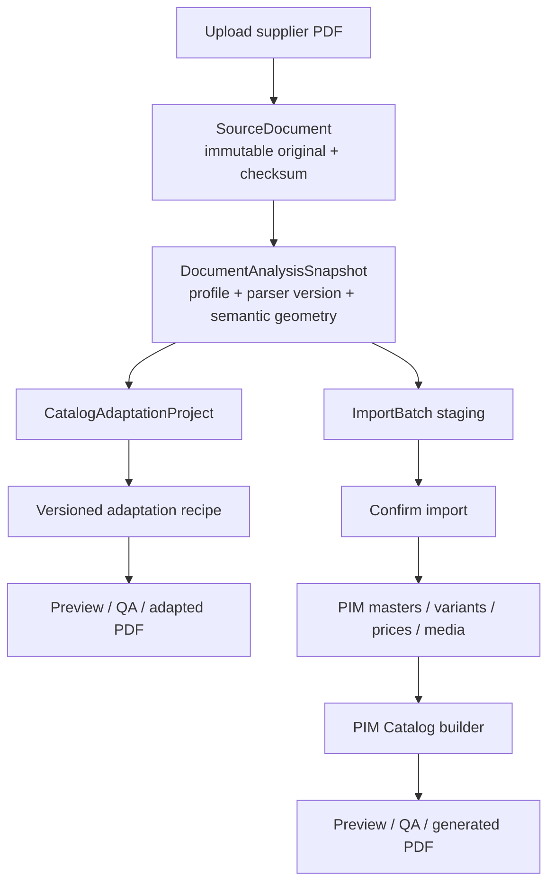

# SOURCE-CATALOG-DUAL-PATH-1 - Direct Adaptation and PIM Import

**Status:** `ACTIVE TRACK / PHASE-1A-PAUSED-RECOVERABLE`

**Recorded:** 2026-06-11

**Active priority impact:** This track became the active priority by explicit
user decision on 2026-06-11. `IMPORT-FDL-FULL-QUALITY` remains paused/deferred,
not closed.

**Objective:** incorporate the successful direct FDL catalogue-personalization
workflow into the PIM as a product feature, while preserving the existing
structured import path and preventing state, pricing, media, or rendering
semantics from leaking between both workflows.

## 1. Product Decision

A supplier PDF uploaded to Narofitness becomes an immutable
`SourceDocument`. From that source, the user can start either workflow
independently:

1. **Direct catalogue adaptation**
   - Preserves the supplier catalogue as the structural source.
   - Applies a versioned transformation recipe.
   - Produces a branded/customized derived PDF and validation report.
   - Does not create or update PIM products, variants, price lists, or catalog items.

2. **Structured PIM import**
   - Parses and reviews product candidates.
   - Confirms normalized masters, variants, specs, media, and supplier prices.
   - Creates PIM-backed catalogues through the existing catalog builder.

There is no third combined execution mode. The same immutable source can launch
both workflows, but each execution has its own lifecycle, state, approvals, and
outputs.

### Closed terminology

| Term | Meaning |
|---|---|
| Source document | Immutable uploaded supplier PDF |
| Direct adaptation | Source-preserving customization that produces a derived PDF |
| PIM import | Structured extraction and confirmation into PIM entities |
| PIM catalogue | Existing DB-backed `Catalog` composed from normalized variants |
| Adapted PDF | Derived artifact, never a PIM catalogue and never an import source |

## 2. Non-Negotiable Domain Boundaries

### Decision A - `Catalog` remains PIM-backed only

Do not reuse the existing `Catalog` entity for direct adaptations. `Catalog`
currently assumes DB-backed `CatalogItem` variants, markups, layouts, covers,
preview, and export. A direct adaptation does not satisfy those invariants.

Create a separate aggregate, provisionally named `CatalogAdaptationProject`.

### Decision B - original source is immutable

The original PDF is stored once, addressed by checksum, and never overwritten.
Every analysis, import batch, recipe version, preview, report, and export records
the source checksum and processing versions used.

### Decision C - an adapted PDF is never re-imported automatically

If the user later chooses PIM import, the system imports from the original
`SourceDocument`, not from the adapted output. This prevents transformed prices,
redrawn text, removed supplier content, or layout changes from corrupting source
provenance.

### Decision D - shared analysis, separate destination state

Both workflows may consume the same versioned semantic analysis of the source
PDF. They must not share mutable workflow state:

- Direct adaptation consumes geometry, page roles, sections, product blocks,
  price slots, references, and image placements.
- PIM import consumes product candidates and maps them into staging
  `ImportRow` records before confirmation.
- Direct recipe changes never mutate an `ImportBatch`.
- Import review/confirmation never mutates an adaptation recipe or output.

### Decision E - no arbitrary-PDF promise

Direct adaptation is profile-driven. A source document must match a supported
document profile and capability set. An unknown or changed supplier layout is
reported as `profile_not_supported` or `profile_recalibration_required`; it is
not processed using unsafe guesses.

### Decision F - no productive page/SKU hardcodes

Production logic cannot contain exceptions by page, SKU, or one-off row.

Allowed:

- Supplier/layout profile rules based on repeatable structural patterns.
- Semantic section assets, such as a cover assigned to category `CARDIO`.
- User-authored project overrides targeting stable detected block IDs, stored as
  project data and reported in the manifest.
- Page/SKU references in fixtures, audits, and regression proof.

## 3. Target Architecture



### Shared foundation

- Secure PDF intake and immutable object storage
- Content hashing and deduplication
- Document-profile detection
- Versioned semantic source analysis
- Extracted source assets and provenance
- Background job execution and progress
- PDF.js viewer and artifact download
- Validation manifests and audit history
- Shared value objects for pricing policies, themes, and assets

### Intentionally separate

| Direct adaptation | PIM import/catalogue |
|---|---|
| `CatalogAdaptationProject` | `ImportBatch`, PIM entities, `Catalog` |
| Source geometry and block IDs | Master/variant/category IDs |
| Adaptation recipe versions | Import review and confirm decisions |
| Adaptation exports | Existing `CatalogExport` records |
| Direct price transformation report | Supplier prices and `CatalogItem` pricing |
| Source-layout renderer | Existing DB-backed catalogue renderer |

## 4. Semantic Source Model

Introduce a versioned, immutable `DocumentAnalysisSnapshot`. It is the seam
between source parsing and both destination workflows.

Minimum conceptual shape:

```text
DocumentAnalysisSnapshot
  source_document_id
  source_sha256
  document_profile_key
  document_profile_version
  analyzer_version
  config_fingerprint
  page_count
  pages[]
    page_role
    dimensions
    sections[]
    product_blocks[]
      stable_block_id
      family_label
      rows[]
        stable_row_id
        reference
        ean
        name
        base_price
        geometry
      price_slots[]
      image_groups[]
      text_runs[]
  diagnostics
  confidence_summary
  snapshot_fingerprint
```

The model is source-semantic, not PIM-normalized. For example, it can retain the
supplier's original family name and row grouping even when the PIM importer
later maps them into different masters or taxonomy.

### Stable IDs

Stable block and row IDs are derived from the source checksum, semantic role,
and source geometry. They permit project-level user overrides without embedding
page/SKU exceptions in code.

## 5. Document Profiles and Capability Matrix

Each supported supplier/layout version has a `DocumentProfile`.

| Profile field | Purpose |
|---|---|
| `profile_key` and `version` | Reproducible matching and reruns |
| Structural fingerprint rules | Detect supported source layout |
| Analyzer/parser adapter | Build semantic source snapshot |
| Import mapper key | Optional structured PIM import support |
| Adaptation renderer key | Optional direct adaptation support |
| Capability flags | Explicitly state supported transformations |
| Regression fixtures | Prove expected behavior across source revisions |

Example capability flags:

```text
direct.price_transform
direct.main_cover_replace
direct.section_cover_replace
direct.theme_tokens
direct.table_recompose
direct.product_image_layout
import.products
import.prices
import.specs
import.media_candidates
```

A profile may support only import, only adaptation, or both. The UI must show
the detected capabilities before the user starts a workflow.

## 6. Direct Adaptation Contract

### Adaptation recipe

Recipes are immutable versions. Editing creates a new version; it never mutates
an export already produced.

Minimum recipe sections:

| Section | Examples |
|---|---|
| Identity | Project name, source, recipe version |
| Pricing policy | Percentage markup, rounding, currency, price-cell style |
| Theme | Colours, fonts, borders, spacing, footer |
| Covers | Main cover and semantic category-divider assets |
| Header/footer rules | Category/section labels, pagination, legal text |
| Table layout | Column widths, row-density policy, typography |
| Media layout | Centering, padding, shared-image groups, collage policy |
| Overrides | Explicit stable block/row overrides authored by the user |

### Pricing semantics

Direct price transformations are output-only. They never create
`SupplierPriceEntry`, change a product price, or change a PIM `CatalogItem`.

Every price result records:

- Reference or stable row ID
- Source/base price
- Policy and percentage applied
- Rounding mode and currency
- Final/client price
- Validation status

The common pricing-policy schema may be shared with PIM catalog pricing, but its
stored state and side effects remain separate.

### Rendering strategy

The direct renderer supports two explicit page strategies:

1. `source_overlay`
   - Used when the original layout can be safely preserved.
   - Replaces/redraws bounded regions and full-page covers.

2. `semantic_recompose`
   - Used when product rows, images, pagination, or table geometry must be rebuilt.
   - Renders from the semantic source snapshot while preserving source content.

The profile selects permitted strategies by semantic page role. No silent
fallback from failed recomposition to an approximate overlay is allowed.

### Direct-adaptation lifecycle

```text
draft
  -> analyzing
  -> recipe_ready
  -> preview_rendering
  -> qa_required
  -> approved
  -> export_rendering
  -> exported

Any processing state may end in failed or cancelled.
```

Approval is tied to a specific source checksum, analysis snapshot, recipe
version, renderer version, and preview manifest. Any change invalidates approval.

## 7. Structured PIM Import Contract

The current high-level import lifecycle remains:

```text
SourceDocument + DocumentAnalysisSnapshot
  -> ImportBatch / ImportRows
  -> review
  -> confirm
  -> PIM entities + SupplierPriceList
  -> optional PIM Catalog
```

Required future adjustment:

- `ImportBatch` references `source_document_id` and `analysis_snapshot_id`.
- Upload and analysis happen once; import preview consumes the stored source.
- Existing importer gates, taxonomy, grouping, specs, and confirmation remain
  owned by the PIM import domain.
- Pages `11`, `12`, `13`, and `14` remain mandatory regressions for FDL-related
  importer changes.

## 8. Persistence Proposal

Names are provisional, but aggregate boundaries are decided.

### New shared entities

| Entity | Key responsibility |
|---|---|
| `source_documents` | Immutable PDF identity, checksum, storage key, metadata |
| `document_analysis_snapshots` | Versioned semantic analysis and diagnostics |
| `source_document_assets` | Extracted images/fonts/assets with provenance and hash |

### New direct-adaptation entities

| Entity | Key responsibility |
|---|---|
| `catalog_adaptation_projects` | Direct workflow aggregate and active recipe |
| `catalog_adaptation_recipe_versions` | Immutable recipe JSON and fingerprints |
| `catalog_adaptation_exports` | Preview/final artifacts and render manifests |
| `catalog_adaptation_approvals` | Who approved which exact version tuple |

### Existing entities retained for PIM path

- `ImportBatch` and `ImportRow`
- Product masters, variants, specs, and images
- `SupplierPriceList` and entries
- `Catalog`, `CatalogItem`, presentation settings, and `CatalogExport`

### Background jobs decision

Use one generic job system for both paths, but jobs must reference a generic
subject (`subject_type`, `subject_id`) rather than adding a dedicated nullable
foreign key for every future workflow.

Candidate job types:

```text
source_document_analyze
catalog_adaptation_preview
catalog_adaptation_export
catalog_import_preview
bulk_import_confirm
catalog_export_pdf
media_processing
```

Current repository reality: `BackgroundJob`, job API, in-process runner, and a
`catalog_export_pdf` handler exist, while some coordination documents still
describe jobs as not started. Reconcile and validate this state before treating
jobs as an implementation-ready dependency.

## 9. API Direction

Exact schemas require an implementation contract, but resource ownership is
decided.

```text
POST /api/v1/source-documents
GET  /api/v1/source-documents/{id}
POST /api/v1/source-documents/{id}/analysis-jobs
GET  /api/v1/source-documents/{id}/capabilities

POST /api/v1/source-documents/{id}/adaptations
GET  /api/v1/catalog-adaptations/{id}
POST /api/v1/catalog-adaptations/{id}/recipe-versions
POST /api/v1/catalog-adaptations/{id}/preview-jobs
POST /api/v1/catalog-adaptations/{id}/approvals
POST /api/v1/catalog-adaptations/{id}/export-jobs

POST /api/v1/source-documents/{id}/import-previews
POST /api/v1/import-batches/{id}/confirm
```

The future import endpoint should reference a stored source document rather than
uploading the PDF again. Direct adaptation and PIM import launch from the same
source-document detail page.

## 10. UX Contract

### Entry point

Use a single action: **Nuevo catálogo desde PDF**.

After upload and capability detection, show two clear paths:

| Path | User promise |
|---|---|
| Personalizar PDF original | Fast branded output; products are not added to the PIM |
| Importar productos al PIM | Structured reusable product data; requires review and confirmation |

Do not present a combined checkbox or wizard that obscures which domain will be
modified. From the source-document page, the user may start the other path later.

### Separate workspaces

- **Adaptation Studio:** source pages, recipe controls, preview, QA flags,
  price report, approve/export.
- **Import Review:** parsed rows, grouping, taxonomy, specs, blocked rows,
  confirm.
- **PIM Catalog Builder:** existing DB-backed product selection and presentation.

Reuse PDF.js preview and process-center UI, but keep actions and statuses
specific to the active workflow.

## 11. Provenance, Idempotency, and Reproducibility

Every output manifest records:

- Source document ID and SHA-256
- Analysis snapshot ID and fingerprint
- Profile key/version
- Recipe or import configuration fingerprint
- Parser/analyzer/renderer versions
- Assets and asset checksums
- Job ID, timestamps, and actor
- Validation metrics and approval state

### Idempotency

- Identical source + analysis configuration reuses a valid analysis snapshot.
- Identical source + recipe + renderer + assets may reuse an approved output.
- Identical import execution may reuse analysis, but creates a distinct
  `ImportBatch` review/confirmation history.
- Final files are written atomically; failed/cancelled jobs never publish a
  partial final artifact.

Binary PDF checksums may differ because of metadata. Reproducibility is judged
primarily by the render manifest fingerprint plus semantic validation metrics.

## 12. QA and Acceptance Gates

### Shared intake gates

- Valid PDF, safe path handling, page count and file-size limits
- Source checksum and immutable storage proof
- Profile match and capability report
- Analysis confidence and diagnostics
- Sandboxed/resource-limited PDF processing

### Direct adaptation gates

| Gate | Target |
|---|---|
| PDF validity | Opens and renders all pages |
| Page-role coverage | Every page classified or explicitly unsupported |
| Reference parity | All detected source references accounted for |
| Price parity | Every target price changed exactly once; non-target prices unchanged |
| Price report | Base and final price recorded for every transformed reference |
| Image preservation | Expected source image groups represented; no border overlap/cropping |
| Geometry | No detected text/cell overflow or invalid page bounds |
| Determinism | Same manifest inputs produce the same semantic output metrics |
| Approval | Required for the exact preview/render tuple before final export |

### PIM import gates

Existing `IMPORT-FDL-FULL-QUALITY` gates remain authoritative. Direct-adaptation
success cannot be used as proof that an import is correct, and vice versa.

### Cross-path isolation tests

- Running direct adaptation creates no PIM products, variants, supplier prices,
  catalog items, or PIM catalogues.
- Confirming an import does not alter an adaptation recipe, preview, approval,
  or exported PDF.
- Both paths can execute from one source document concurrently without state
  collision.
- Deleting/archiving one workflow does not delete the immutable source while
  another workflow references it.

## 13. Security and Operational Rules

- Validate PDF structure and reject encrypted/unsupported files unless an
  explicit secure flow exists.
- Process untrusted PDFs in a constrained worker with time, memory, page-count,
  and output-size limits.
- Store source files and artifacts outside public paths; downloads use
  authorized endpoints or short-lived signed URLs.
- Do not permit arbitrary local paths, executable hooks, templates, or external
  fetches from adaptation recipes.
- Keep source retention, artifact retention, and project archival policies
  separate.
- Log actor, recipe/import version, approval, export, cancellation, and failure.

## 14. Delivery Plan

Do not begin these phases until the active priority is complete or the user
explicitly reprioritizes the track.

**Current progress:** Phase 0 completed on 2026-06-11. Phase 1A private immutable
source intake is locked and awaits explicit user confirmation before product
implementation. See [SOURCE_CATALOG_PHASE0_DECISIONS.md](./SOURCE_CATALOG_PHASE0_DECISIONS.md).

### Phase 0 - Contract and prototype capture

Owner: Agent 3 + Agent 6 + Agent 2

- Convert the standalone FDL work into a capability inventory and regression set.
- Record current direct-output metrics: 65 pages, reference/price parity, image
  placement cases, shared-image rows, covers, and category dividers.
- Define the first `DocumentAnalysisSnapshot` JSON contract.
- Reconcile actual background-job implementation against coordination docs.

Exit gate: approved architecture decision record and fixtures; no product code.

### Phase 1 - Source document foundation

Owner: Agent 2

- Implement immutable source storage, hashing, metadata, and analysis snapshots.
- Add document profile registry and capability detection.
- Link new import batches to stored sources without changing importer semantics.
- Add shared provenance and artifact-storage helpers.

Exit gate: upload once, analyze once, launch isolated import preview from stored
source; all importer regressions pass.

### Phase 2 - Direct adaptation MVP for FDL profile

Owner: Agent 6 + Agent 2

- Productize the systemic behavior proven by the standalone FDL prototype.
- Implement versioned recipe, preview job, validation manifest, price report,
  approval, and final export.
- Support only explicitly declared FDL capabilities.
- No page/SKU hardcodes; any user override is persisted recipe data.

Exit gate: reproduce the accepted 65-page FDL direct output from a stored source
with deterministic metrics and zero PIM writes.

### Phase 3 - Dual-path intake UX

Owner: Agent 1B + Agent 4

- Add **Nuevo catálogo desde PDF** intake and source-document detail.
- Show detected capabilities and the two separate workflow actions.
- Build Adaptation Studio shell and connect jobs, preview, QA, approval, export.
- Preserve existing Import Review semantics.

Exit gate: user can launch either path from one source and clearly understand
which records each path changes.

### Phase 4 - Shared-analysis hardening

Owner: Agent 2 + Agent 5 + Agent 6

- Reduce duplicate source parsing between adaptation and import.
- Expand semantic source diagnostics and profile-regression tooling.
- Prove cross-path isolation, idempotency, cancellation, and retry behavior.
- Add full-catalog audit reports for adaptation.

Exit gate: same analysis snapshot safely supports both routes for the FDL profile.

### Phase 5 - Multi-profile scale

Owner: Agent 2 + Agent 6

- Add profile calibration tooling and capability-driven onboarding.
- Add further supplier layouts only through fixtures and systemic profile rules.
- Measure effort, unsupported-page rate, and QA cost per new profile.

Exit gate: onboarding a second structurally different supplier does not require
page/SKU hardcodes or changes to core workflow code.

### Phase 6 - Optional media enhancement

Track: `MEDIA-ENHANCE-1`

- Add deterministic enhanced derivatives as an optional source-asset capability.
- Keep originals immutable and require approval before use.
- Direct adaptation and PIM media may independently select approved derivatives.

## 15. Delivery Ownership and Scope Locks

| Agent | Allowed scope when activated |
|---|---|
| Agent 2 | Source model, storage, profile registry, analysis, import linkage, jobs/backend |
| Agent 6 | Direct renderer, recipes, manifests, PDF preview/export, render QA |
| Agent 1B | Intake and Adaptation Studio UX |
| Agent 4 | Frontend API contracts and wiring after backend contracts are confirmed |
| Agent 5 | Read-only profile, import, and adaptation audits |
| Agent 3 | Coordination, contracts, acceptance gates, collision prevention |

No agent may combine direct adaptation and PIM import into one mutable aggregate
or bypass review/approval gates for convenience.

## 16. Principal Risks and Mitigations

| Risk | Mitigation |
|---|---|
| Direct mode becomes a collection of one-off PDF scripts | Profile registry, capability matrix, fixtures, no page/SKU code exceptions |
| Direct outputs pollute PIM prices/products | Separate aggregates and isolation tests |
| Adapted PDFs become accidental import sources | Original-source-only import rule |
| Shared parser refactor regresses current FDL import | Phase separation and mandatory pages 11/12/13/14 regressions |
| Unknown supplier layout produces plausible but wrong output | Explicit unsupported/recalibration state; no unsafe fallback |
| Recipe edit invalidates approved PDF silently | Immutable recipe versions and approval fingerprint |
| Long jobs block API or corrupt files | Generic jobs, constrained workers, atomic output publication |
| Jobs documentation and implementation disagree | Reconciliation gate before Phase 1 |
| User cannot tell which workflow to choose | Separate promises, workspaces, statuses, and side-effect copy |

## 17. Feature-Level Acceptance Criteria

- `DP-1`: One immutable source document can launch either or both workflows.
- `DP-2`: Direct adaptation produces no PIM product, price, item, or catalogue writes.
- `DP-3`: PIM import always reads the original source, never an adapted PDF.
- `DP-4`: Both paths consume a versioned semantic source analysis where supported.
- `DP-5`: Unsupported source layouts fail explicitly, not approximately.
- `DP-6`: Direct output is reproducible from source, profile, recipe, assets, and versions.
- `DP-7`: Every direct price transformation has reference/base/final-price audit proof.
- `DP-8`: Every final direct export has approval tied to its exact render tuple.
- `DP-9`: Import and adaptation jobs can run independently and safely retry/cancel.
- `DP-10`: No productive page/SKU/one-row hardcodes are introduced.
- `DP-11`: FDL importer regressions pages `11/12/13/14` remain PASS.
- `DP-12`: A second supplier profile proves the architecture is not FDL-specific.

## 18. Decisions Intentionally Deferred

These decisions should be made from measured prototypes, not guessed now:

- Object-storage provider and signed-download mechanism
- Queue/worker deployment provider
- Whether semantic snapshots live fully in PostgreSQL JSONB or object storage
  with indexed summary fields in PostgreSQL
- Exact recipe editor UX and permitted low-level overrides
- Direct-adaptation commercial packaging and usage limits
- Profile-calibration tooling depth

The aggregate boundaries, immutable-source rule, original-source-only import
rule, profile-driven support model, and cross-path isolation are not deferred.

## 19. Phase 0 Artifacts

- [SOURCE_CATALOG_PHASE0_DECISIONS.md](./SOURCE_CATALOG_PHASE0_DECISIONS.md)
- [SOURCE_CATALOG_PHASE1A_BATCH_PLAN.md](./SOURCE_CATALOG_PHASE1A_BATCH_PLAN.md)
- [FDL_DIRECT_ADAPTATION_BASELINE.md](./contracts/FDL_DIRECT_ADAPTATION_BASELINE.md)
- [SOURCE_DOCUMENT_ANALYSIS_V1_CONTRACT.md](./contracts/SOURCE_DOCUMENT_ANALYSIS_V1_CONTRACT.md)
- [BACKGROUND_JOBS_RECONCILIATION_SOURCE_CATALOG.md](./contracts/BACKGROUND_JOBS_RECONCILIATION_SOURCE_CATALOG.md)
