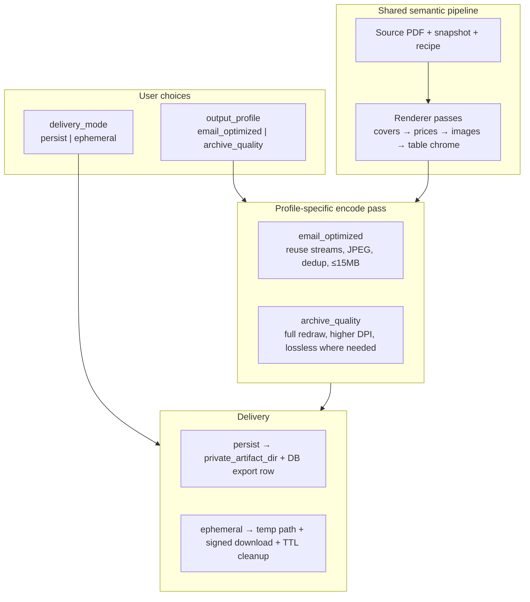

# Adaptation Output Delivery — Dual Profile + Persist/Ephemeral Plan

**Track:** `SOURCE-CATALOG-DUAL-PATH-1`  
**Status:** `DECIDED / PLANNING`  
**Recorded:** 2026-06-14  
**Parent plan:** [SOURCE_CATALOG_DUAL_PATH_PLAN.md](./SOURCE_CATALOG_DUAL_PATH_PLAN.md)

## 1. Product decision

The accepted standalone prototype produced a **~134 MB** PDF. That size is **not** a
product target. Users need:

1. **Two output strategies** — selectable before generation:
   - **Email-optimized** — maximum practical quality within a **≤15 MB** budget
     (email attachment friendly).
   - **Archive quality** — maximum visual fidelity for print/internal archive;
     no hard size ceiling (soft warn above ~50 MB).

2. **Two delivery modes** — selectable before generation:
   - **Persist** — store manifest + PDF on the server; listable in project
     history; required for approval and final export.
   - **Ephemeral** — generate a temporary artifact for immediate download only;
     optional skip of durable export row; automatic TTL cleanup.

Both axes are **orthogonal** and must be combined explicitly in API, recipe,
manifest, and UI. Defaults must be safe for distribution:

```text
default output_profile  = email_optimized
default delivery_mode   = persist   (preview QA history)
ephemeral default TTL   = 3600 s    (1 hour, configurable)
```

## 2. Conceptual model



### Terminology (closed)

| Term | Meaning |
|---|---|
| `output_profile` | Compression and redraw strategy (`email_optimized`, `archive_quality`) |
| `delivery_mode` | Whether artifacts are durably stored or download-only ephemeral |
| `export_kind` | Workflow stage (`preview`, `final`) — unchanged |
| `render_tuple` | Source + snapshot + recipe + renderer version + output_profile |

Changing `output_profile` or `delivery_mode` creates a **new render intent**;
it does not silently mutate an approved tuple.

## 3. Output profiles

### 3.1 `email_optimized` (default)

| Field | Value |
|---|---|
| Target size | ≤15,728,640 bytes (15 MiB) |
| Primary use | Email, WhatsApp, quick client send |
| Image strategy | Reuse unchanged source streams; JPEG Q85–92 for redrawn/collage cells; deduplicate identical assets |
| Table strategy | Incremental overlay (current Phase 2 pipeline) until full redraw ships with compression guard |
| Parity gate | `output_size_within_budget` + all semantic gates (rows, images, collages) |
| Failure mode | If budget exceeded after encode pass → job `failed` with `size_budget_exceeded` and observed bytes |

### 3.2 `archive_quality`

| Field | Value |
|---|---|
| Target size | No hard cap; informational warn ≥50 MB |
| Primary use | Print, internal archive, pixel-level QA |
| Image strategy | Full re-embed; higher effective DPI; lossless PNG where redrawn |
| Table strategy | Full table cell redraw (Phase 2 parity track) when implemented |
| Parity gate | Semantic + visual QA gates; size gate is **informational only** |
| Failure mode | Semantic/geometry gate failure only |

### 3.3 Shared invariant

Both profiles run the **same semantic pipeline** up to the encode pass. Profile
only changes how bytes are written and which redraw depth is enabled. Manifest
records `output_profile`, `byte_length`, and profile-specific metrics.

## 4. Delivery modes

### 4.1 `persist` (durable)

- Write manifest JSON + PDF under **`private_artifact_dir`** (not `data_dir`).
- Create or update `catalog_adaptation_exports` row with:
  - `output_profile`, `delivery_mode`, `expires_at` (null)
  - `artifact_path`, `pdf_artifact_path` (relative keys)
- Expose authorized download:
  - `GET /api/v1/catalog-adaptations/{id}/exports/{export_id}/download?artifact=pdf|manifest`
- Retention: project lifecycle policy; archival on project delete.
- **Required** for `export_kind=final` and approval workflow.

### 4.2 `ephemeral` (download-only)

- Write PDF (+ optional slim manifest summary) to **worker temp** or
  `private_artifact_dir/ephemeral/{job_id}/` with `expires_at`.
- Job metadata carries `download_token`, `expires_at`, `content_type`.
- `GET /api/v1/jobs/{id}/download` serves PDF with correct `Content-Type` and
  `Content-Disposition`; 410 Gone after TTL.
- DB options (pick one in implementation — **Option A recommended**):
  - **Option A:** Minimal `catalog_adaptation_exports` row marked
    `delivery_mode=ephemeral`, `expires_at` set; cleanup job deletes files + row.
  - **Option B:** No export row; job `metadata` only. Harder to audit; not recommended.
- Ephemeral previews **do not** satisfy approval; user must re-run with `persist`
  before approve/export.

### 4.3 Cleanup

- Background sweeper: delete expired ephemeral files and rows hourly.
- Log `artifact_expired` with job_id, project_id, profile, bytes freed.

## 5. Recipe and manifest contract

### 5.1 Recipe extension (`direct-adaptation-recipe/v1`)

```json
{
  "output_delivery": {
    "profile": "email_optimized",
    "delivery_mode": "persist",
    "ephemeral_ttl_seconds": 3600,
    "email_budget_bytes": 15728640,
    "archive_soft_warn_bytes": 52428800
  }
}
```

Project default lives in recipe; per-job request may override for preview only.
Final export uses recipe default unless explicitly versioned in recipe JSON.

### 5.2 Job request body (preview + export)

```json
{
  "output_profile": "email_optimized",
  "delivery_mode": "ephemeral",
  "ephemeral_ttl_seconds": 7200
}
```

Validation rules:

| Rule | Enforcement |
|---|---|
| `final` + `ephemeral` | **Reject** 400 — finals must persist |
| `approve` + ephemeral preview | Approval UI disabled until persist preview exists |
| Unknown profile | 400 `profile_not_supported` |
| TTL | 300 s – 86400 s |

### 5.3 Manifest fields (additive)

```json
{
  "output_delivery": {
    "profile": "email_optimized",
    "delivery_mode": "persist",
    "byte_length": 4105095,
    "budget_bytes": 15728640,
    "within_budget": true,
    "encode_pass": "jpeg_dedup_v1"
  }
}
```

## 6. API surface

### Implemented today

- `POST .../preview-jobs` — no body; always `persist`; always implicit `email_optimized` pipeline

### Target (Phase 3 + parity slices)

| Method | Path | Purpose |
|---|---|---|
| POST | `/catalog-adaptations/{id}/preview-jobs` | Body: `output_profile`, `delivery_mode`, optional TTL |
| POST | `/catalog-adaptations/{id}/export-jobs` | Final export; `delivery_mode` must be `persist` |
| GET | `/catalog-adaptations/{id}/exports` | List exports with profile + delivery + size |
| GET | `/catalog-adaptations/{id}/exports/{export_id}/download` | Authorized PDF/manifest download |
| GET | `/jobs/{id}/download` | Ephemeral or job result; correct content-type |

## 7. UI contract (Adaptation Studio)

Placement: **Generate** panel (preview and final), after recipe summary.

### Controls

1. **Formato de salida** (radio)
   - `Catálogo para email` — subtitle: "Máx. 15 MB, ideal para adjuntar"
   - `Calidad de archivo` — subtitle: "Máxima fidelidad visual; puede superar 15 MB"

2. **Destino del fichero** (radio)
   - `Guardar en el proyecto` — subtitle: "Queda en historial; necesario para aprobar"
   - `Solo descarga temporal` — subtitle: "Enlace válido 1 h; no se guarda en historial"

### UX rules

- Ephemeral + final → control hidden (final always persist).
- After preview completes: show **observed size**, budget status badge, download CTA.
- Email profile over budget → red badge + "Reintentar con calidad de archivo" suggestion.
- Approval button enabled only when latest **persist** preview matches approved tuple.
- Process center: show `catalog_adaptation_preview` / `catalog_adaptation_export` with profile label.

## 8. Parity track integration (`PHASE-2-PARITY`)

Retire the old "≥134 MB means done" gate. Split measurable gates by profile:

| Gate | `email_optimized` | `archive_quality` |
|---|---|---|
| `output_size_within_budget` | PASS if ≤15 MB | N/A (informational) |
| `output_size_reported` | observed bytes | observed bytes + warn if large |
| Semantic gates (rows, images, collages) | PASS | PASS |
| `full_table_cell_redraw` | deferred with compression | required for archive parity |

Renderer work splits:

- **2Y+** (parity): archive profile encode + full table redraw path
- **2Z** (proposed): email profile compression pass (`jpeg_dedup_v1`)
- Both profiles share snapshot geometry and recompose logic from 2T–2X

## 9. Delivery slices (cross-track)

| Slice | Track | Scope | Depends on |
|---|---|---|---|
| **SC-DP-SLICE-31** | PHASE-2-PARITY | Recipe `output_delivery`; renderer profile switch; manifest fields | 2X |
| **SC-DP-SLICE-32** | PHASE-2-PARITY | `email_optimized` compression pass + size budget enforcement | 31 |
| **SC-DP-SLICE-33** | PHASE-2-PARITY | `archive_quality` full redraw depth (table typography) | 31 |
| **SC-DP-SLICE-22** | PHASE-3 | Source intake shell (unchanged) | Phase 1 |
| **SC-DP-SLICE-34** | PHASE-3 | Export list + download APIs; fix job download content-type | 31 |
| **SC-DP-SLICE-35** | PHASE-3 | Ephemeral storage, TTL, sweeper | 34 |
| **SC-DP-SLICE-36** | PHASE-3 | Adaptation Studio UI — profile + delivery controls | 22, 34 |
| **SC-DP-SLICE-37** | PHASE-3 | Approval + final export (persist only) | 35, 36 |

Slices 31–33 can run parallel to Phase 3 intake (22) without UI collision.

## 10. Persistence and security

- Move adaptation artifacts from `data_dir` → **`private_artifact_dir`** (aligns with plan §13).
- Ephemeral paths must not be web-static mounted.
- Downloads always via authorized API or short-lived signed token.
- Manifest records actor, profile, delivery_mode, TTL, and storage key.
- Config additions:
  - `adaptation_ephemeral_ttl_default_seconds`
  - `adaptation_email_budget_bytes`
  - `adaptation_archive_soft_warn_bytes`

## 11. Acceptance criteria (additive)

- **DP-13:** User can select `email_optimized` or `archive_quality` before preview/export; manifest records the choice.
- **DP-14:** User can select `persist` or `ephemeral` for preview; ephemeral artifacts expire and are removed.
- **DP-15:** `email_optimized` output ≤15 MB on FDL reference or fails with explicit `size_budget_exceeded`.
- **DP-16:** Final export and approval require `delivery_mode=persist`; ephemeral previews cannot be approved.

## 12. Risks

| Risk | Mitigation |
|---|---|
| Two profiles diverge in behavior | Shared semantic pipeline; single manifest schema; profile only in encode pass |
| Ephemeral files fill disk | TTL sweeper; max concurrent ephemeral jobs per project |
| User approves wrong profile | Approval tuple includes `output_profile`; UI shows profile badge |
| Email profile regresses quality | Semantic gates unchanged; visual QA sample pages in regression |
| UI complexity | Sensible defaults; advanced options collapsed under "Opciones de entrega" |

## 13. Related artifacts

- [SOURCE_CATALOG_DUAL_PATH_PLAN.md](./SOURCE_CATALOG_DUAL_PATH_PLAN.md) — §10 UX, §12 gates, Phase 3
- [FDL_DIRECT_ADAPTATION_BASELINE.md](./contracts/FDL_DIRECT_ADAPTATION_BASELINE.md) — semantic baseline (not size target)
- `apps/api/app/services/direct_adaptation/parity_audit.py` — `output_size_within_budget` gate
- `docs/control/tasks/SOURCE-CATALOG-DP-PHASE3-SLICE-SELECTION.md` — intake + studio roadmap
